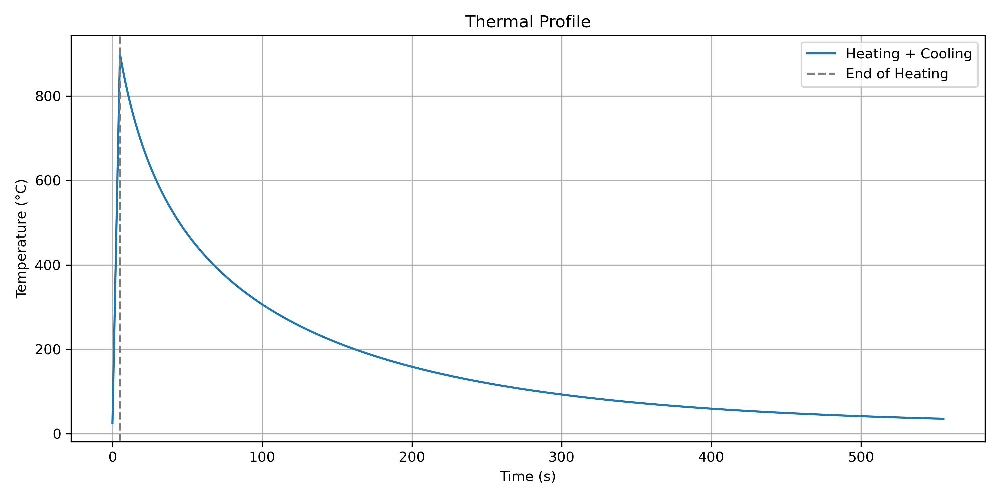

# Single Element Transient Thermal Model

This module implements a simple transient thermal finite element simulation for a single element using [deal.II](https://dealii.org/). It serves as the baseline for future extensions involving phase change modelling using kMC and JMAK methods.

The description of the solver is given in [TransientThermal.md](./TransientThermal.md)



## Features

- Time-dependent temperature boundary conditions from external input
- Temperature-dependent material properties (thermal conductivity, specific heat)
- Baseline for thermal benchmarking

## Structure

- `TransientThermal.cpp` – Core implementation of the thermal solver
- `temperature_input.dat` – Input file specifying temperature vs. time
- `cp_table.dat`, `k_table.dat` – Material property tables
- `Solution/` – Output files (VTU, Gnuplot)
- `generate_temperature_input.py` – Generating AM-like thermal data with empirical equations
- `generate_pvd.py` – Generating VTU result mapping for ParaView
- `result.py` – Plotting temperature for all nodes
- `solution.pvd` - ParaView file for visualising results

## Building and running

> [!WARNING]
>
> This section only covers building and running with the predefined parameters. If any changes are made to the `TransientThermal.cpp` file for modifying
> the total time or time step, the `solution.pvd` needs to be regenerated by redefining the parameters in `generate_pvd.py`

To build the files, the cleanest way is to create a `build` directory and run `cmake` from the build directory to seperate your auxillary files.

```bash
mkdir -p build && cd build
cmake ..
make
```

This will generate an executable file `TransientThermal` in the main directory which can be run to solve the model. Following which the results can be opened on paraview.

```bash
# from inside of ./build
cd ..
./TransientThermal
paraview solution.pvd
```

---
