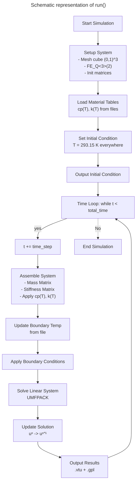

# Single Element Transient Thermal with `deal.II`

The single element transient thermal model has been created as the base for the implementation of kMC and JMAK.  
The model is built with `deal.II`.

## Classes

### `TimeDependentTemperature`

This class is used to take input from a file describing the time and the temperature.

- The constructor reads a file and populates a `temperature_data` vector with (time, temperature) pairs.
- Temperatures are converted to Kelvin by adding 273.15.
- The private member `interpolate_temperature` performs linear interpolation between the nearest values.
- Extrapolation is not performed — values outside the range are clamped to the minimum or maximum provided.

### `TransientThermalProblem`

This object houses the main problem definition. The class has the following member functions:

1. **`setup_system`**
   - Creates a cube mesh using `GridGenerator::subdivided_hyper_rectangle` between coordinates $(0,0,0)$ and $(1,1,1)$, subdivided into `{2,2,2}` blocks (→ 512 hexahedral elements).
   - Uses quadratic (`Q2`) elements (`FE_Q<3>(2)`).
   - Initialises DoFs, solution vectors, sparsity pattern, and the mass, stiffness, and system matrices.

2. **`assemble_system`**
   - Assembles the consistent mass matrix and conductivity matrix.
   - Material properties (`c_p(T)` and `k(T)`) are interpolated from tables and evaluated at the **average temperature per element**.
   - Forms the system matrix using the θ-method with θ = 1 (implicit Euler).
   - Right-hand side (RHS) is computed as $M \cdot u^{n}$.

3. **`solve_time_step`**
   - Uses the direct solver `UMFPACK` to solve the linear system for the current time step.

4. **`load_material_tables`**
   - Loads `c_p(T)` and `k(T)` from external `.dat` files.
   - Tables are linearly interpolated in temperature.

5. **`output_results`**
   - Exports results each step into `Solution/solution-<timestep>.vtu` for ParaView and `.gpl` for Gnuplot.
   - Both the initial condition (step 0) and subsequent time steps are written.

6. **`run`**
   - Calls `setup_system` and `load_material_tables`.
   - Initialises the solution with a uniform temperature of **293.15 K**.
   - Outputs the initial condition.
   - Advances in time steps until `total_time = 555.0 s`, applying Dirichlet boundary conditions from `temperature_input.dat` via `TimeDependentTemperature`.
   - Each step assembles the system, solves, updates the solution, and outputs results.

## Main function

Instantiates `TransientThermalProblem` and calls `run()` to execute the simulation.

## Summary of Model Assumptions

- **Mesh**: cube domain [0,1]^3, subdivided into 512 quadratic hexahedral elements.
- **Time integration**: backward Euler (θ = 1 implicit).
- **Boundary condition**: Dirichlet temperature from file (clamped outside range).
- **Initial condition**: uniform 293.15 K.
- **Material data**:
  - ρ = 4620 kg/m³ (constant),
  - cp(T), k(T) read from files and interpolated linearly.
- **Outputs**: `.vtu` for ParaView and `.gpl` for Gnuplot at every step.
